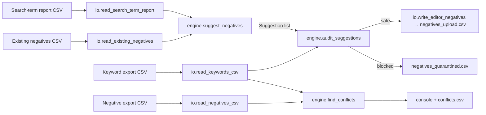

# negkw — Google Ads Negative Keyword Manager

[](https://github.com/mehranmoghadasi/google-ads-negative-keyword-manager/actions/workflows/python-app.yml)
[](https://python.org)
[](LICENSE)
[](pyproject.toml)

> For PPC managers who've ever uploaded a negative that silently killed their own best keyword: `negkw` mines search-term reports for wasted spend, checks every proposed negative against your live keyword set, and exports only the ones that are safe.

```
Mockup — `negkw audit` on a 1,847-row search-term report

negkw audit
━━━━━━━━━━━━━━━━━━━━━━━━━━━━━━━━━━━━━━━━━━━━━━━━━━━━━━━━
Search terms analysed:          1,847
Candidate negatives:              332
Safe to upload:                   319
Quarantined (would self-block):    13
  ✖ "free seo tools"      → blocks [free seo tools] (exact)
  ✖ "seo audit pricing"   → blocks "seo audit" (phrase)
  ✖ "google ads agency"   → blocks +google +ads +agency (broad)

✔ Upload:      output/negatives_upload.csv
! Quarantine:  output/negatives_quarantined.csv
```

## The Problem

Negative-keyword hygiene is one of the highest-ROI tasks in paid search and one of the most error-prone. Managers review search-term reports by hand, export a list, and upload it — and a meaningful share of those uploads contain a negative that overlaps a positive keyword in the same campaign, quietly suppressing converting traffic. Threads like ["Negative keyword blocking my own keyword"](https://www.reddit.com/r/PPC/search/?q=negative+keyword+blocking) recur on r/PPC every month, and Google's own "conflicting negative keywords" recommendation exists precisely because the mistake is common. The fix should happen *before* upload, not after a week of lost conversions.

## The Solution

`negkw` folds three previously separate tools into one workflow:

| Command | What it does | Replaces |
|---|---|---|
| `negkw suggest` | Mines a search-term report (impressions, spend, CTR, zero-conversion rules) → Editor-ready CSV with a *reason* per row | v1 of this repo + a former standalone search-term cleaner |
| `negkw conflicts` | Cross-checks negatives against keywords using Google's actual exact / phrase / broad semantics, scoped by campaign and ad group | a former standalone conflict finder |
| `negkw audit` | Runs `suggest`, then screens each proposed negative against live keywords — safe ones export, self-blocking ones are quarantined with the keyword they'd hit | *new* |

No dependencies. Handles real Google Ads exports: preamble lines, `Impr.` vs `Impressions`, `$1,312.20`, `0.30%`, and the trailing `Total:` row.

## Features

- Zero-conversion mining with four tunable thresholds: `--min-impressions`, `--min-spend`, `--max-ctr`, `--high-impressions`
- `--protect` regex so brand or product terms are never suggested
- De-duplication against an existing negatives export (any format — Editor CSV or bare list)
- Exact, phrase, and broad variants generated per term; campaign- or ad-group-level output
- Every exported row carries a human-readable `Reason` column for reviewer sign-off
- Conflict detection with correct phrase word-boundary matching (`"run"` does **not** block `running shoes`)
- Severity scoring: shared-list and campaign-level negatives rank HIGH; ad-group phrase MEDIUM; broad LOW
- Concrete fix suggestion per conflict
- `--fail-on-conflict` exit code for CI or pre-upload gates
- Monthly archive of applied negatives to avoid re-adding
- 15 unit tests over matching semantics, rules, parsing quirks, and the audit path

## Architecture



Parsing is isolated in `io.py`, pure logic in `engine.py`, and dataclass models in `models.py`, so the engine is testable without touching a file. The conflict checker is reused by the audit path: a proposed negative is just a `NegativeKeyword` built on the fly for each match type you intend to upload.

## Tech Stack

- Python 3.10+ (stdlib only: `csv`, `dataclasses`, `argparse`, `re`)
- Testing: `pytest`; lint: `ruff`; CI: GitHub Actions on Python 3.10 and 3.12 (`pip install -e ".[dev]" && ruff check src tests && pytest -q`)

## Installation

```bash
git clone https://github.com/mehranmoghadasi/google-ads-negative-keyword-manager.git
cd google-ads-negative-keyword-manager
pip install -e ".[dev]"   # or just: pip install -e .
negkw --version
```

## Usage

**1. Mine a search-term report**

```bash
negkw suggest --report search_terms.csv --existing negatives_current.csv \
  --min-impressions 10 --max-ctr 0.02 --min-spend 5 --protect "acme|acmecorp" \
  --match-types exact,phrase --output ./output
```

**2. Check an account for self-blocking negatives (CI-friendly)**

```bash
negkw conflicts --keywords keywords.csv --negatives negatives.csv \
  --min-severity medium --output conflicts.csv --fail-on-conflict
```

**3. The safe path — suggest and screen in one go**

```bash
negkw audit --report search_terms.csv --keywords keywords.csv \
  --existing negatives_current.csv --output ./output
```

Sample inputs live in [`examples/`](examples/). Exports come straight from Google Ads → Reports → Search terms, and Google Ads Editor → Export → Keywords / Negative keywords.

## Sample Output

`output/negatives_upload.csv`

```csv
Campaign,Ad Group,Keyword,Match Type,Status,Reason
SEO_Search,,[seo tutorial],Exact,Enabled,"CTR 0.00% < 2.00%; 60 impr, 0 conv"
SEO_Search,,"""seo tutorial""",Phrase,Enabled,"CTR 0.00% < 2.00%; 60 impr, 0 conv"
```

`output/negatives_quarantined.csv`

```csv
search_term,campaign,cost,impressions,would_block_keyword,keyword_match,severity
free seo tools,SEO_Search,48.20,1312,[free seo tools],exact,high
```

## Related Projects

- [google-ads-campaign-playbook](https://github.com/mehranmoghadasi/google-ads-campaign-playbook) — strategy framework and ROAS calculator that pairs with this tool's hygiene workflow
- [agency-report-builder](https://github.com/mehranmoghadasi/agency-report-builder) — client-ready reporting once the account is clean

## Roadmap

1. Google Ads API mode (`--customer-id`) to pull search terms and keywords without CSV exports
2. Shared negative-list awareness in `audit` (apply list → campaign mappings)
3. Close-variant simulation for exact-match negatives
4. JSON output for dashboards
5. Optional `openpyxl` export for stakeholders who live in Excel

## Project Structure

```
google-ads-negative-keyword-manager/
├── src/negkw/
│   ├── __init__.py      # version
│   ├── models.py        # MatchType, Keyword, NegativeKeyword, Suggestion, Conflict
│   ├── io.py            # tolerant CSV readers + Editor-format writer
│   ├── engine.py        # suggest / conflicts / audit logic
│   └── cli.py           # argparse sub-commands
├── tests/
│   ├── fixtures/        # real-shaped Google Ads exports
│   └── test_engine.py
├── examples/            # copy of fixtures for quick trial
├── .github/workflows/python-app.yml
├── pyproject.toml
└── README.md
```

## Contributing

Issues and PRs welcome — especially real-world export samples that break the parser, and Google Ads matching edge cases you've been bitten by.

## License

MIT — see [LICENSE](LICENSE).

## About the Author

**Mehran Moghadasi** — Digital Marketing & Brand Manager (SEO · Google Ads · Meta Ads · Social Media), Calgary, AB. 13+ years running paid search for service, e-commerce, and professional-services clients.
[github.com/mehranmoghadasi](https://github.com/mehranmoghadasi) · [linkedin.com/in/mehranmoghadasi](https://www.linkedin.com/in/mehranmoghadasi)
